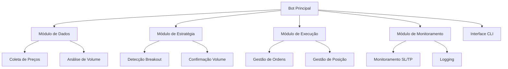
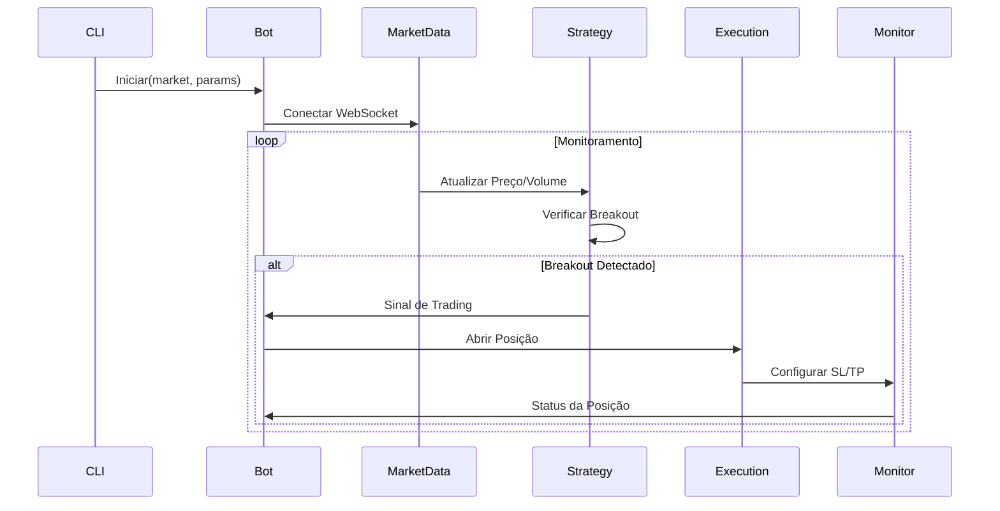

# Plano de Implementação do Bot de Trading dYdX

## 1. Estrutura do Projeto



## 2. Arquivos do Projeto

```
trading-bot/
├── config/
│   ├── config.json        # Configurações gerais
│   └── .env              # Variáveis sensíveis (mnemonic)
├── src/
│   ├── __init__.py
│   ├── bot.py            # Classe principal do bot
│   ├── market_data.py    # Módulo de dados de mercado
│   ├── strategy.py       # Lógica de breakout
│   ├── execution.py      # Execução de ordens
│   ├── monitor.py        # Monitoramento de posições
│   └── utils.py          # Funções auxiliares
├── cli.py                # Interface de linha de comando
├── requirements.txt      # Dependências
└── README.md            # Documentação
```

## 3. Fluxo de Execução



## 4. Implementação por Etapas

1. **Setup Inicial (1-2 dias)**
   - Instalação do ambiente Python
   - Configuração do cliente dYdX
   - Estruturação do projeto
   - Criação de conta testnet e obtenção de fundos

2. **Módulo de Dados (2-3 dias)**
   - Implementação da coleta de dados via WebSocket
   - Cálculo de volumes e médias
   - Cache de dados históricos
   - Tratamento de desconexões

3. **Módulo de Estratégia (2-3 dias)**
   - Detecção de níveis de resistência
   - Cálculo de anomalias de volume
   - Lógica de confirmação de breakout
   - Backtesting simples

4. **Módulo de Execução (2-3 dias)**
   - Interface com API dYdX
   - Gestão de ordens
   - Cálculo de SL/TP
   - Validações de conta/saldo

5. **Módulo de Monitoramento (2 dias)**
   - Sistema de logging
   - Monitoramento de posições
   - Gestão de SL/TP
   - Alertas de eventos importantes

6. **Interface CLI (1-2 dias)**
   - Argumentos de linha de comando
   - Configuração via arquivo
   - Comandos interativos
   - Output formatado

7. **Testes e Otimização (3-4 dias)**
   - Testes unitários
   - Testes de integração
   - Ajuste de parâmetros
   - Documentação

8. **Deployment (1-2 dias)**
   - Setup em servidor Linux
   - Configuração systemd
   - Monitoramento remoto
   - Backup e recuperação

## 5. Parâmetros Configuráveis

```json
{
  "trading": {
    "market": "ETH-USD",
    "timeframe": "5m",
    "volume_factor": 2.5,
    "risk_reward_ratio": 3.0
  },
  "risk": {
    "max_position_size": 0.1,
    "max_risk_per_trade": 0.02
  },
  "technical": {
    "resistance_period": 24,
    "volume_lookback": 20
  }
}
```

## 6. Considerações de Segurança

1. **Proteção de Credenciais**
   - Armazenamento seguro do mnemonic
   - Variáveis de ambiente criptografadas
   - Permissões restritas de arquivos

2. **Validações de Entrada**
   - Sanitização de parâmetros
   - Verificação de limites
   - Proteção contra injeção

3. **Limites de Posição**
   - Tamanho máximo de posição
   - Limite de perdas diárias
   - Stop-loss obrigatório

4. **Tratamento de Erros**
   - Recuperação de falhas
   - Logs detalhados
   - Notificações de erro

5. **Backup de Dados**
   - Backup regular de configs
   - Histórico de operações
   - Restauração de estado

## 7. Métricas de Monitoramento

1. **Performance**
   - Taxa de acerto de trades
   - Retorno por operação
   - Drawdown máximo
   - Razão de Sharpe

2. **Operacional**
   - Latência de execução
   - Uptime do bot
   - Uso de recursos
   - Taxa de erros

3. **Análise**
   - Distribuição de retornos
   - Correlação volume/preço
   - Eficácia dos breakouts
   - Qualidade das saídas

## 8. Próximos Passos

1. Criar estrutura inicial do projeto
2. Implementar primeiro módulo (Dados)
3. Testar conexão com dYdX testnet
4. Desenvolver demais módulos
5. Realizar testes integrados
6. Preparar para deployment